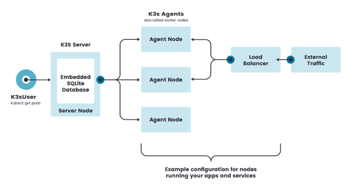
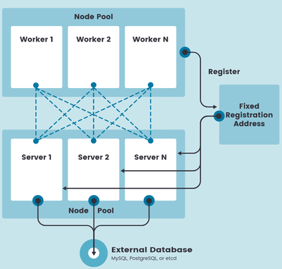

# K3s

<!-- @import "[TOC]" {cmd="toc" depthFrom=2 depthTo=6 orderedList=false} -->

<!-- code_chunk_output -->

- [Architecture](#architecture)
- [Quick-Start Guide](#quick-start-guide)
  - [Master](#master)
  - [Worker](#worker)

<!-- /code_chunk_output -->

## Architecture

Single-server Setup with an Embedded DB



High-Availability K3s Server with an External DB


Fixed Registration Address for Agent Nodes



Agent nodes are registered with a websocket connection initiated by the `k3s agent` process, and the connection is maintained by a client-side load balancer running as part of the agent process.

Agents will register with the server using the node cluster secret along with a randomly generated password for the node, stored at `/etc/rancher/node/password`. The server will store the passwords for individual nodes at `/var/lib/rancher/k3s/server/cred/node-passwd`, and any subsequent attempts must use the same password.

If the `/etc/rancher/node` directory of an agent is removed, the password file should be recreated for the agent, or the entry removed from the server.

A unique node ID can be appended to the hostname by launching K3s servers or agents using the `--with-node-id` flag.

## Quick-Start Guide

https://rancher.com/docs/k3s/latest/en/quick-start/

### Master

```bash
root@master:~# curl -sfL https://get.k3s.io | sh -
[INFO]  Finding release for channel stable
[INFO]  Using v1.18.3+k3s1 as release
[INFO]  Downloading hash https://github.com/rancher/k3s/releases/download/v1.18.3+k3s1/sha256sum-amd64.txt
[INFO]  Downloading binary https://github.com/rancher/k3s/releases/download/v1.18.3+k3s1/k3s
[INFO]  Verifying binary download
[INFO]  Installing k3s to /usr/local/bin/k3s
[INFO]  Skipping /usr/local/bin/kubectl symlink to k3s, command exists in PATH at /usr/bin/kubectl
[INFO]  Skipping /usr/local/bin/crictl symlink to k3s, command exists in PATH at /usr/bin/crictl
[INFO]  Skipping /usr/local/bin/ctr symlink to k3s, command exists in PATH at /usr/bin/ctr
[INFO]  Creating killall script /usr/local/bin/k3s-killall.sh
[INFO]  Creating uninstall script /usr/local/bin/k3s-uninstall.sh
[INFO]  env: Creating environment file /etc/systemd/system/k3s.service.env
[INFO]  systemd: Creating service file /etc/systemd/system/k3s.service
[INFO]  systemd: Enabling k3s unit
Created symlink /etc/systemd/system/multi-user.target.wants/k3s.service → /etc/systemd/system/k3s.service.
[INFO]  systemd: Starting k3s
root@master:/etc/systemd/system# cat /etc/systemd/system/k3s.service
[Unit]
Description=Lightweight Kubernetes
Documentation=https://k3s.io
Wants=network-online.target

[Install]
WantedBy=multi-user.target

[Service]
Type=notify
EnvironmentFile=/etc/systemd/system/k3s.service.env
KillMode=process
Delegate=yes
# Having non-zero Limit*s causes performance problems due to accounting overhead
# in the kernel. We recommend using cgroups to do container-local accounting.
LimitNOFILE=1048576
LimitNPROC=infinity
LimitCORE=infinity
TasksMax=infinity
TimeoutStartSec=0
Restart=always
RestartSec=5s
ExecStartPre=-/sbin/modprobe br_netfilter
ExecStartPre=-/sbin/modprobe overlay
ExecStart=/usr/local/bin/k3s \
    server --node-external-ip=192.168.0.90 \

root@master:/etc/systemd/system# cat /var/lib/rancher/k3s/server/node-token
K101e51df3537f55c71b3edd8ce12c3bff19944abdec82d6b289380eb4d710fe44c::server:ad277e45d3709c464b784c9e1266315b
```

### Worker

```bash
root@ubuntu:/home/ubuntu# export K3S_TOKEN=K101e51df3537f55c71b3edd8ce12c3bff19944abdec82d6b289380eb4d710fe44c::server:ad277e45d3709c464b784c9e1266315b
root@ubuntu:/home/ubuntu# export K3S_URL=https://192.168.0.90:6443
root@ubuntu:/home/ubuntu# curl -sfL https://get.k3s.io | sh -
[INFO]  Finding release for channel stable
[INFO]  Using v1.18.3+k3s1 as release
[INFO]  Downloading hash https://github.com/rancher/k3s/releases/download/v1.18.3+k3s1/sha256sum-arm64.txt
[INFO]  Downloading binary https://github.com/rancher/k3s/releases/download/v1.18.3+k3s1/k3s-arm64
[INFO]  Verifying binary download
[INFO]  Installing k3s to /usr/local/bin/k3s
[INFO]  Creating /usr/local/bin/kubectl symlink to k3s
[INFO]  Creating /usr/local/bin/crictl symlink to k3s
[INFO]  Creating /usr/local/bin/ctr symlink to k3s
[INFO]  Creating killall script /usr/local/bin/k3s-killall.sh
[INFO]  Creating uninstall script /usr/local/bin/k3s-agent-uninstall.sh
[INFO]  env: Creating environment file /etc/systemd/system/k3s-agent.service.env
[INFO]  systemd: Creating service file /etc/systemd/system/k3s-agent.service
[INFO]  systemd: Enabling k3s-agent unit
Created symlink /etc/systemd/system/multi-user.target.wants/k3s-agent.service → /etc/systemd/system/k3s-agent.service.
[INFO]  systemd: Starting k3s-agent
root@ubuntu:/home/ubuntu# cat /boot/firmware/cmdline.txt 
net.ifnames=0 dwc_otg.lpm_enable=0 console=serial0,115200 cgroup_enable=cpuset cgroup_enable=memory cgroup_memory=1 console=tty1 root=LABEL=writable rootfstype=ext4 elevator=deadline rootwait fixrtc
root@ubuntu:/home/ubuntu# reboot
```

https://ithelp.ithome.com.tw/articles/10221929
https://kubernetes.io/zh/docs/concepts/configuration/assign-pod-node/
https://kubernetes.io/docs/concepts/scheduling-eviction/assign-pod-node/#built-in-node-labels